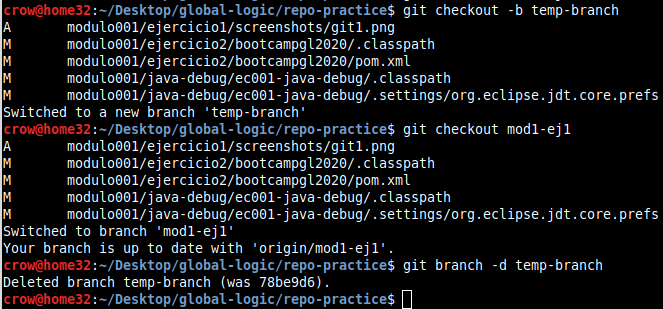

- [X] 1. Creación de un nuevo repositorio en GitHub

- [X] 2. Crear un nuevo repositorio local (ver comandos git init, git add, git commit y git push)

- [X] 3. Crear un nuevo branch e interactuar con el master. (Ver comando git checkout -b,git add, git commit, git merge, git push y git pull)
  

- [X] 4. Deshacer cambios guardados

- [X] 5. Eliminar un branch de forma local
  
