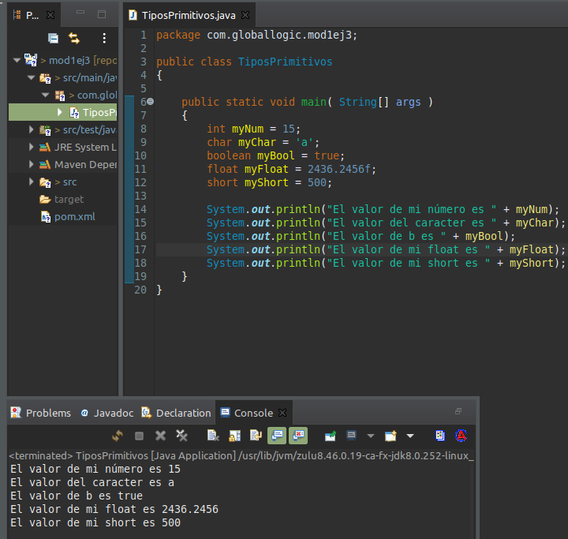
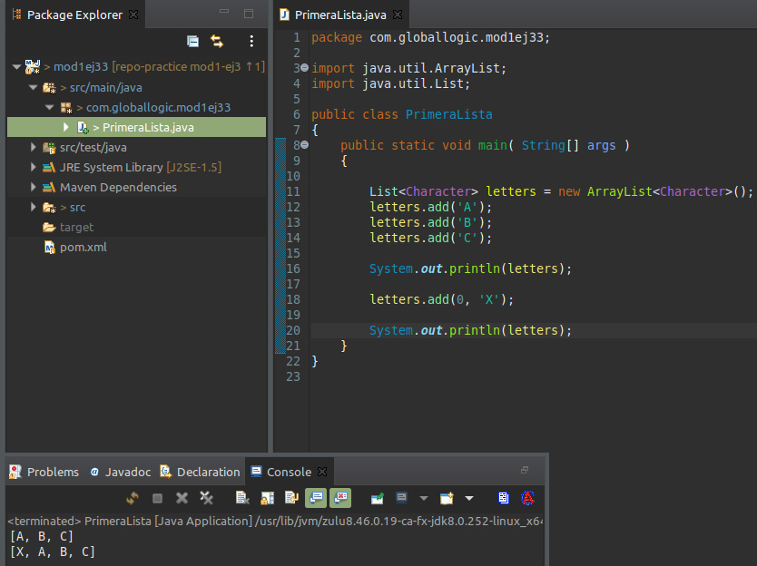

### Estructuras básicas

1. Creación de tipo de datos primitivos.   
Pasos:
- Crear una clase TiposPrimitivos con un método main()
- Dentro del método crear una variable llamada myNum de tipo int y asignarle el valor 15.
- Imprimir el valor utilizando System.out.println(myNum);
- Crear una variable de tipo char, asignar el valor 'a' e imprimir su valor.
- Crear una variable de tipo booleano, asignar el valor true e imprimir su valor.
- Crear una variable de tipo float, asignar el valor '2436.2456' e imprimir su valor.
- Crear una variable de tipo short, asignar el valor '500' e imprimir su valor.  

2. Crear una clase PrimeraVariable, agregar un método main(), dentro del método crear una variable de tipo String mensaje y asignes como valor de inicial "Valor inicial",imprimir el valor. A continuación asígnar a la variable mensaje el valor "Valor modificado" y vuelva a imprimirla.  

3. Crear una clase PrimeraLista , agregar un método main(), dentro del método crear una Lista de Strings letters y agregar a la lista A, B y C.
	1. Imprimir la lista y luego imprimir la cantidad de elementos que posee la lista.
	2. Agregar en la primera posición el elemento X y volver a imprimir la lista.  

4. 
- Parte 1
	- Crear una nueva clase VariableLocal con un método main().
	- Agregar un método studentAge, dentro crear una variable de tipo int con nombre age y valor 0 y sumar el valor 5.
	- Imprimir el valor de la variable agregando como mensaje lo siguiente “La edad del estudiante es:”.
	- En el main, crear una variable de tipo local de nombre estudiante, crear una instancia de StudentDetails y luego invocar al método studentAge. Ejecutar el main para ver la salida.
- Parte 2
	- Luego de ver la salida anterior lo que hacemos es tomar el mensaje “La edad del estudiante es :” del método studentAge,cortarlo y ponerlo en el main, eliminando la llamada a la clase que hicimos anteriormente.
	- Luego volvemos a ejecutar el main para ver la salida. Notar el resultado de la ejecución.  

5. Crear una nueva clase VariableInstancia.  
En la clase agregamos 3 variables entera engPoints, mathsPoints y phyPoints.  
Crear otra clase PointDemo que posea un método main().  
En el método main() crear una variable de tipo VariableInstancia con nombre vI y la inicializamos.
Le asignamos a engPoints el valor 50 y a mathsPoints el valor 80.
Imprimir el valor.  

6. Crear una nueva clase Empleado.  
En la clase agregamos 2 variables estáticas salario de tipo double y nombre String. A nombre inicializarla con el valor “Alex”.  
Crear otra clase EmpleadoDemo que posea un método main().  
En el método main() asignarle el valor de 1000 a la variable salario y a continuación imprimir el valor como por ejemplo “Alex tiene un salario promedio de 1000”.  

