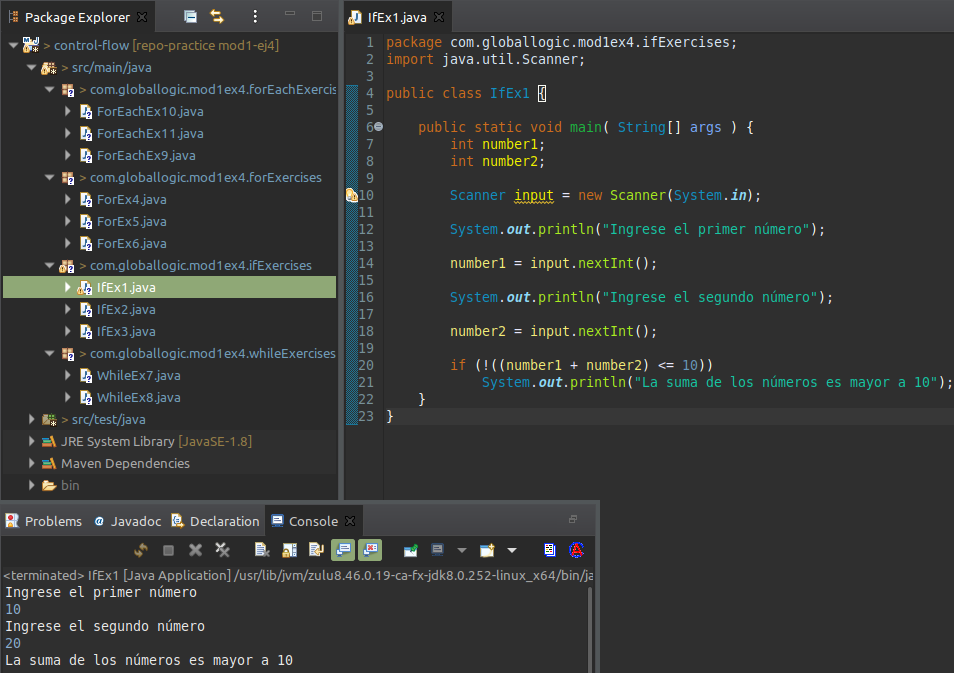
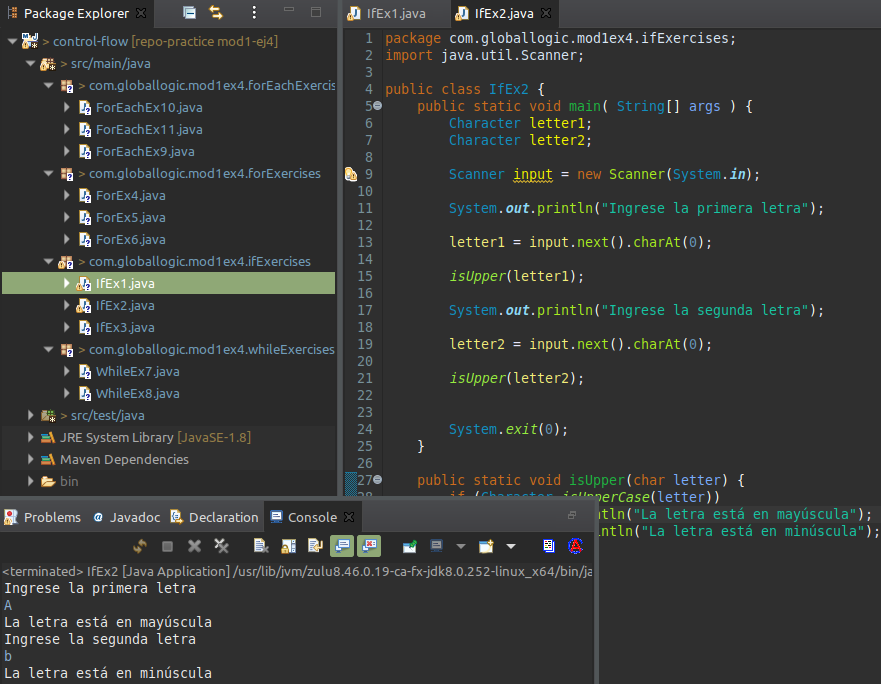
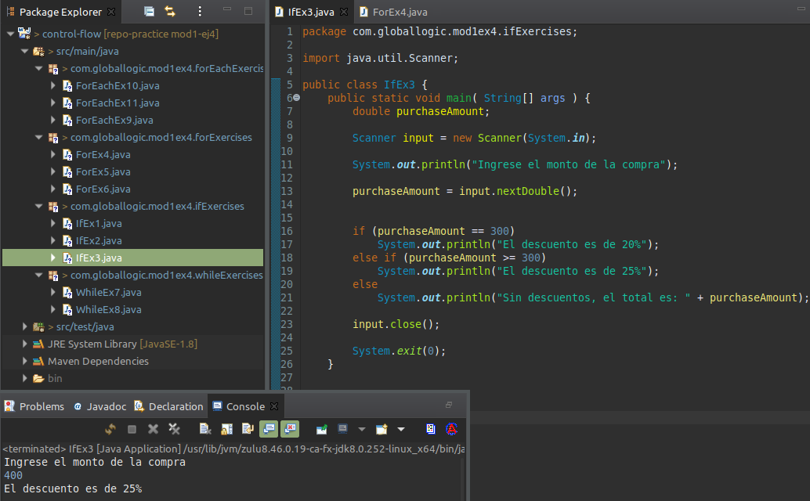
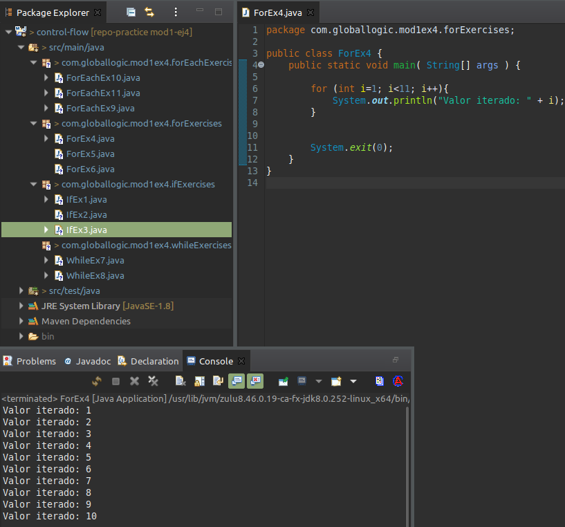
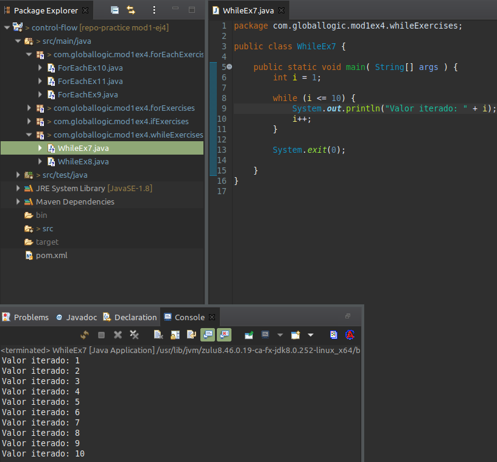
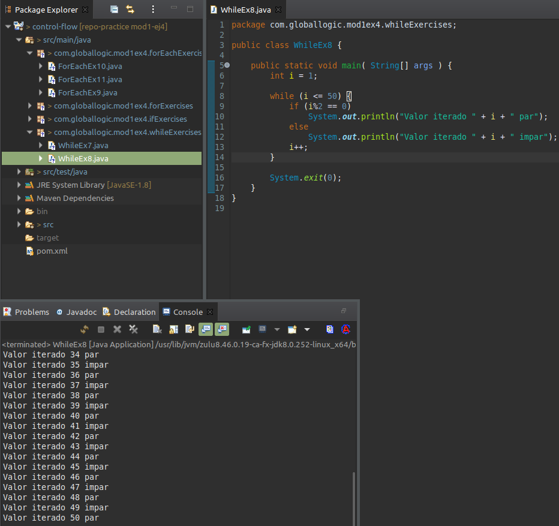
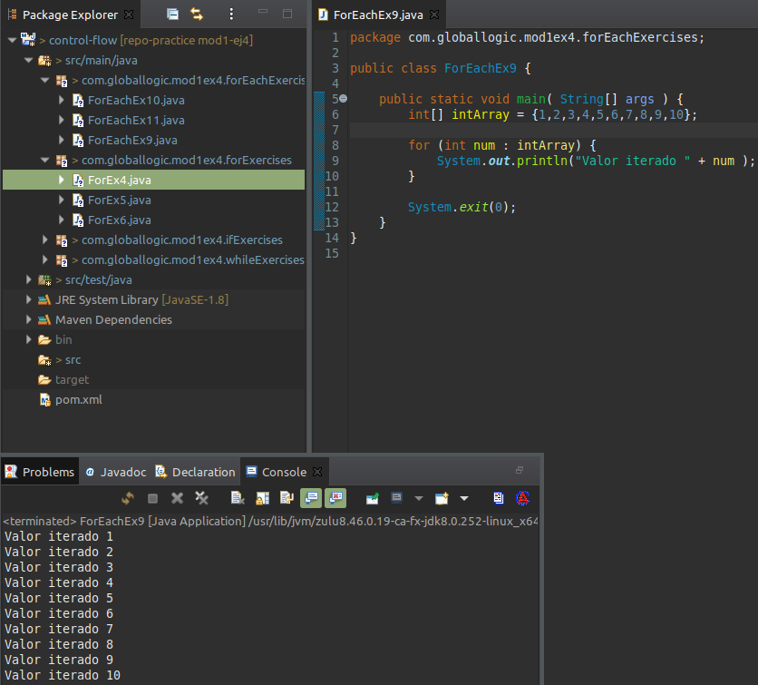
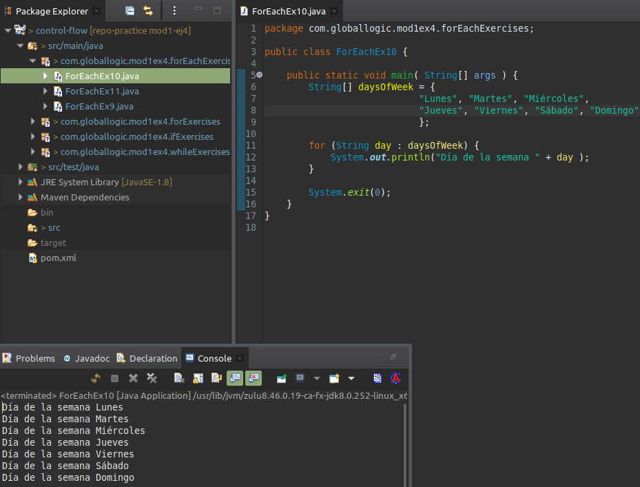
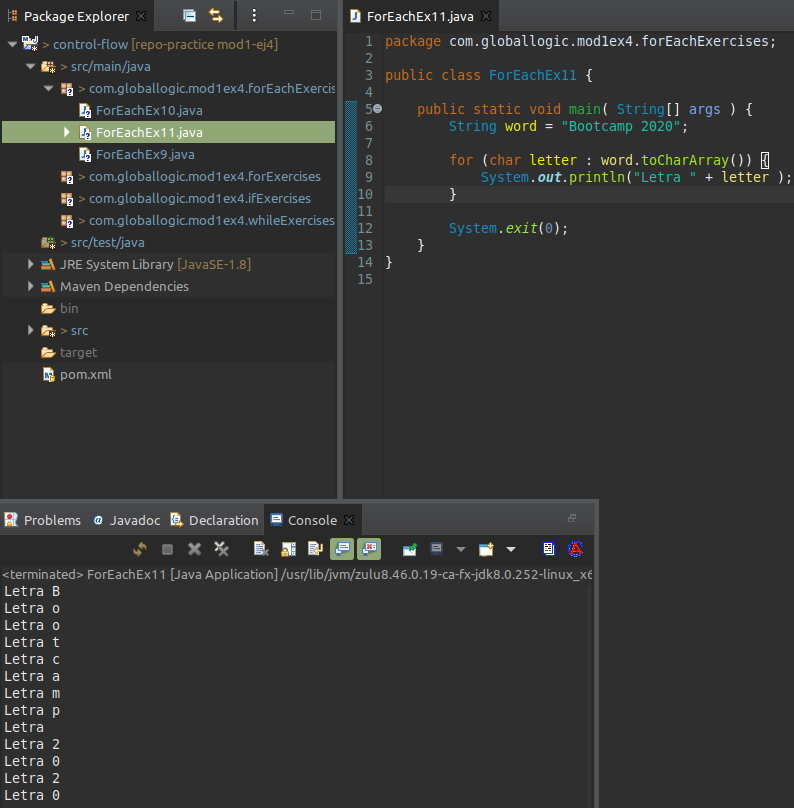

## Control de flujos

### If    
1. Ingresar dos valores numéricos, si la suma es superior a 10 mostrar su suma.  
Pasos:
- Crear dos variables del tipo numérico con los valores 3 y 10.
- Realizar la suma de dichas variables.
- Verificar con la cláusula IF si el valor la suma es menor o igual a 10. En el caso de serlo, imprimir el mensaje "La suma de los numeros es : " concatenado a la variable que contiene la suma, utilizando System.out.println. Caso contrario, dentro de un ELSE imprimir el mensaje "La suma de los numeros es Mayor a 10"  
  
 	
  
2. Dados los siguientes valores de entrada “A” y “b”, determinar si una letra es mayúscula o no.  
- Imprimir "Es una letra mayuscula" en el caso de ser mayúscula.
- Imprimir "No es una letra mayuscula" en el caso de ser minúscula.
    
 	
  
3. Mediante la cláusula IF resolver la siguiente problemática  
	En Tienda se hace un 20% de descuento a los clientes cuya compra sea igual a $300, del 25% a los clientes cuya compra sea mayor a $350 y sin descuento cuando no se cumple ninguna de las anteriores condiciones.  
	En el caso de tener descuento, imprimir los siguientes mensajes:  
		_El descuento es de: <valor>_  
	En el caso de no tener descuento, imprimir el siguiente mensaje:
		_Sin descuentos, el total es: <valor>_
Ejecutar este ejemplo, tomando como entrada una compra de $400  
  
 	
  
  
### For
4. Realizar un for de 1 a 10, imprimiendo el valor iterado  
Pasos:
- Colocar la cláusula For, valor inicial i=1, valor final <=10, y que incremente en 1  
- Imprimir mediante System.out.println el siguiente mensaje “Valor iterado: ” concatenado con el valor de i  
Ejemplo salida:  
		Valor iterado: 1  
		Valor iterado: 2  
  
 	
  
5. Realizar un For de 0 a 10000, en cada iteración verificaremos si el número en el que estamos es divisible por 20 o no y en caso afirmativo aumentaremos un contador en 1 (Sumar 1). Se deberá imprimir el valor final del contador.  
  
6. Crear un array string con todos los días de la semana ("Lunes", "Martes", "Miercoles", "Jueves", "Viernes", "Sabado", "Domingo"), recorrer ese array con un For e imprimir cada uno de los valores.  
Ejemplo salida:  
		Dia de la semana: Lunes  
		Dia de la semana: Martes  
  
### While
7. Realizar un While de 1 a 10, imprimiendo el valor iterado  
Pasos :  
- Colocar la cláusula While valor inicial 1, valor final <=10  
- Imprimer mediante System.out.println el siguiente mensaje “Valor iterado: ” concatenado con el valor de i  
Ejemplo salida:  
		Valor iterado: 1  
		Valor iterado: 2  
  
 	
    
  
8. Realizar un While de 1 a 50, imprimir “Valor iterado <valor> par” (Si el valor es par) o imprimir “Valor iterado <valor> impar”(si el valor es impar).  
Ejemplo salida:
		Valor iterado 1 impar  
		Valor iterado 2 par    
   
 	
  
### For each
9. Iterar un Array Integer con un For each  
Pasos:  
- Crear una Array del tipo Integer con valores del 1 al 10  
- Colocar la cláusula for con una variable num del tipo Integer, y asignarle la variable creada en el punto anterior.  
- Imprimer mediante System.out.println el siguiente mensaje “Valor iterado: ” concatenado con el valor de i
Ejemplo salida:  
		Valor iterado: 1  
		Valor iterado: 2  
  
 	
   
  
10. Crear un array string con todos los días de la semana ("Lunes", "Martes", "Miercoles", "Jueves", "Viernes", "Sabado", "Domingo"), recorrer ese array con un For each e imprimir cada uno de los valores.
Ejemplo salida:  
		Dia de la semana: Lunes  
		Dia de la semana: Martes  
   
 	
  
11. Iterar con un For each el string “BootCamp 2020” e imprimir cada carácter.  
Ejemplo salida:
		Letra: B  
		Letra: o  
		Letra: o  
  
 	
  
