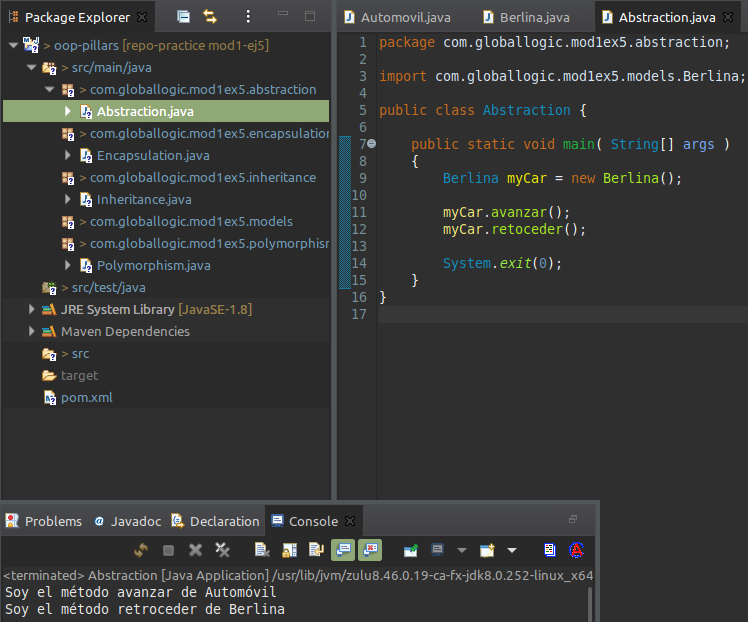

## Pilares de programación orientada a objetos
Dado el siguiente diagrama de clases. Crear las clases y subclases que se muestran.  
  
  
  
### Herencia  
- Crear clases: Electrodoméstico y Heladera que se muestran en el diagrama.  
- Hacer que Heladera extienda de Electrodoméstico.  
- A la hora de implementar los métodos hacerlo imprimiendo una descripción de su comportamiento. Ej: System.out.println("Encendiendo electrodoméstico")  
- Crear una instancia de Electrodoméstico y una de Heladera.  
- Imprimir atributos y métodos de las instancias de Electrodoméstico y Heladera.  
  
    
  
### Polimorfismo

- Crear todas las clases del diagrama anterior.  
- Sobrescribir el método encender en cada subclase.  
- Crear una instancia de cada electrodoméstico (Heladera, Cafetera, Televisor)  
- Hacer una lista de electrodomésticos  
- Agregar cada instancia a la lista de electrodomésticos  
- Recorrer la lista y llamar al método encender  
  
    
  
### Encapsulamiento
```java
	public class Gato {
		private String nombre;  
		private int patas;  
  
		public getNombre(){ return nombre;}  
		public getPatas(){ return patas;}  
  		
		public setNombre(String nuevoNombre){ nombre = nuevoNombre;}  
		public setPatas(int numeroPatas){ patas = numeroPatas;}  
}
```
- Instanciar la clase Gato
- Setear un nombre y patas al objeto Gato
- Imprimir por pantalla nombre y número de patas

    

  
### Abstracción
```java
	abstract class Automovil {
  		
		abstract void retoceder();
		void avanzar() {
			System.out.println("Soy el metodo avanzar de Automovil");
		}
	}
```
- Extender la clase Berlina de la clase Automovil
- Implementar el metodo avanzar
- Imprimir por pantalla el mensaje correspondiente

    
