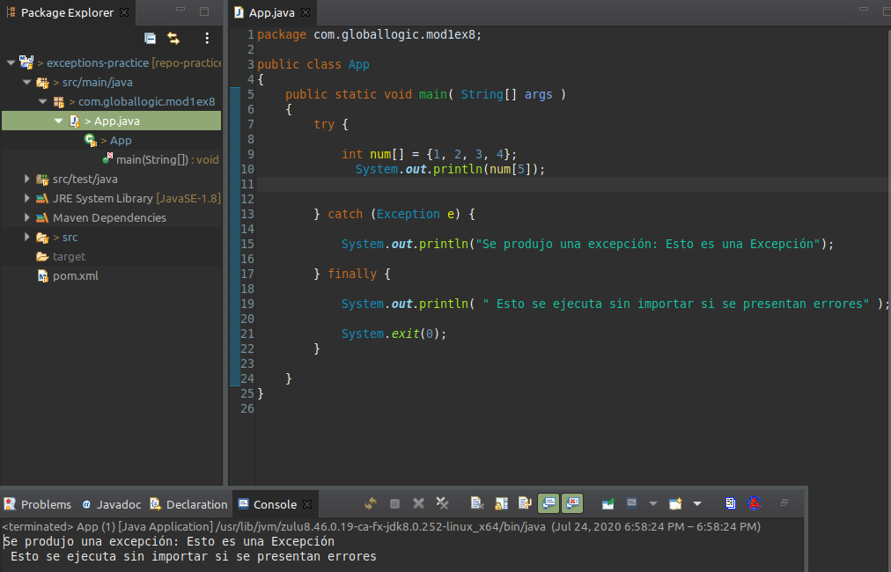
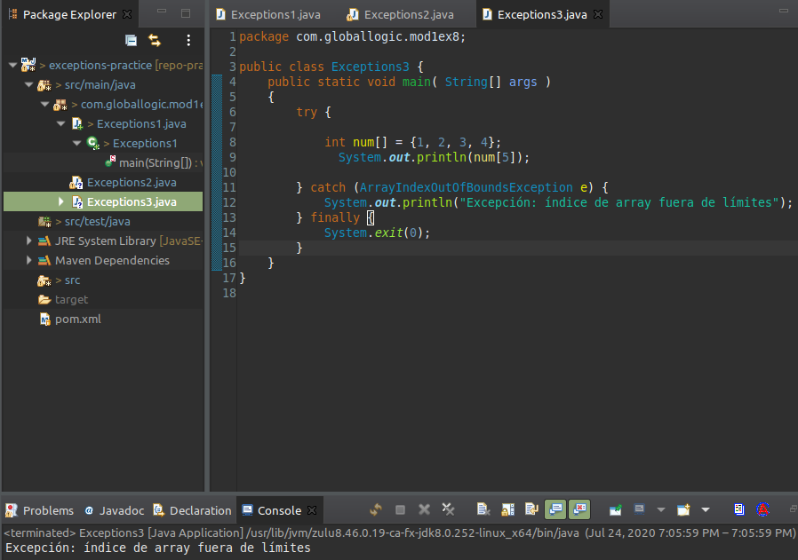
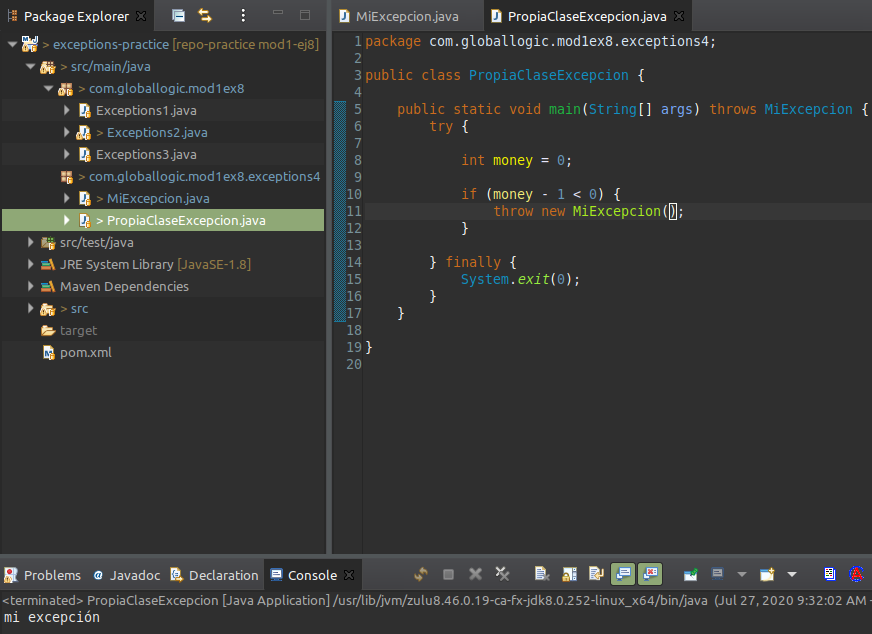

## Excepciones  
1.    
- Crear una clase con un método main()  
- Generar un objeto de la clase Exception dentro de un bloque try.  
- Proporcionar al constructor de Exception un argumento String.  
- Capturar la excepción dentro de una cláusula catch e imprimir el argumento String.  
- Añadir una cláusula finally e imprima el mensaje "Esto se ejecuta sin importar si se presentan errores" para demostrar que pasó por allí.  
Se espera como salida:  
	```  
	Se produjo una excepción: Esto es una Excepción  
	Esto se ejecuta sin importar si se presentan errores  
	```  
  
  
  
2. A partir de un objeto inicializado en null, ejecute un método de este y capture la excepción mostrando en la salida: "Se produjo una excepción. null"  
  
  
  
3. Escriba código para generar y capturar la excepción ArrayIndexOutOfBoundsException (Índice de matriz fuera de límites) mostrando en la consola "Excepción: índice de array fuera de límites"  
  
  
  
4. Crear su propia clase de excepción (Llamada MiExcepcion) extendiendo la clase Exception. Dicha clase deberá almacenar internamente una referencia de tipo String. Escriba un método que muestre la cadena de caracteres almacenada.  
Crear otra clase llamada "PropiaClaseExcepcion" donde capture la excepción anterior y utilice el método para mostrar el sting almacenado.  
  
  
