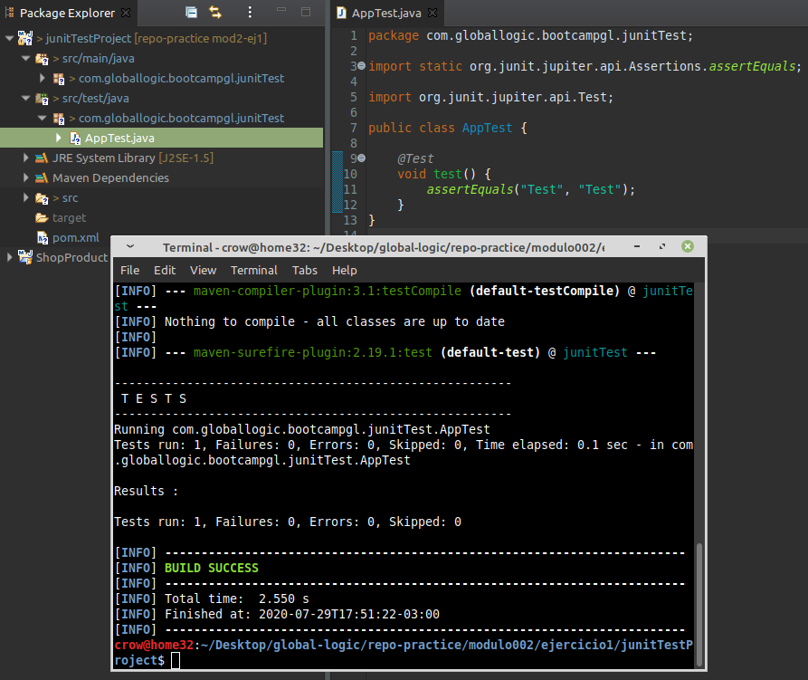
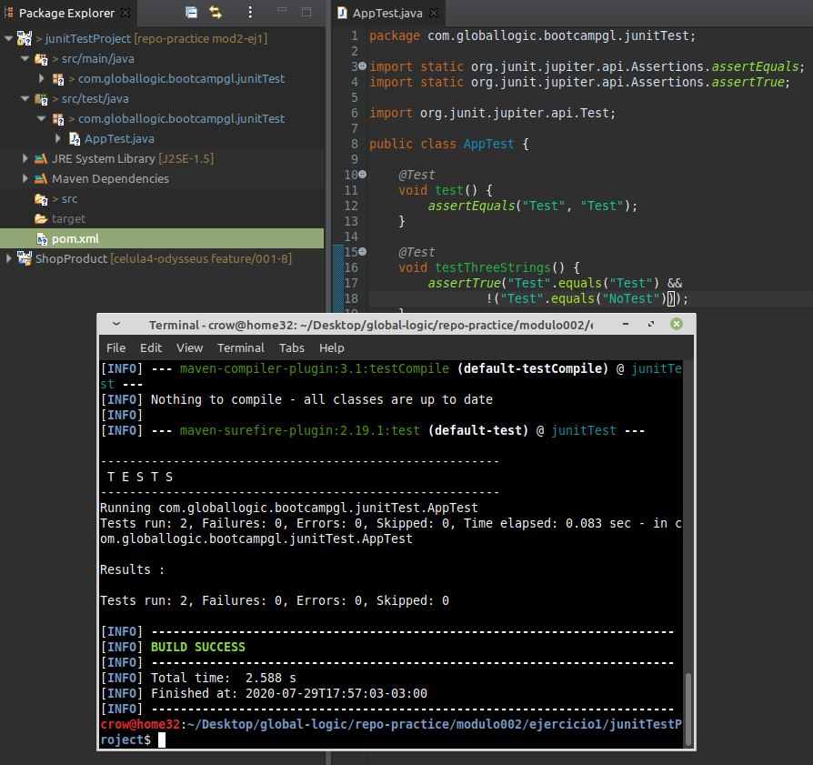
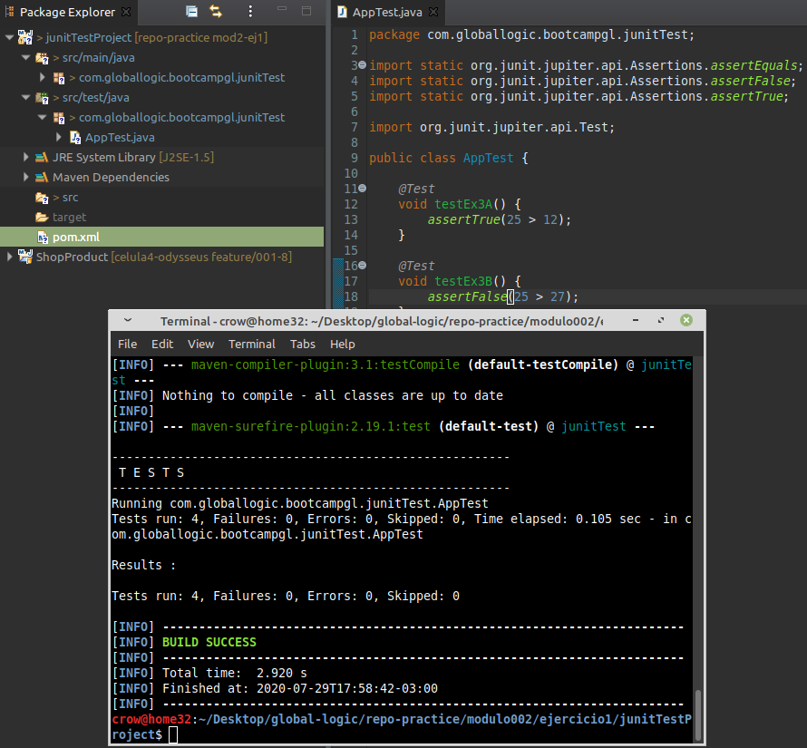
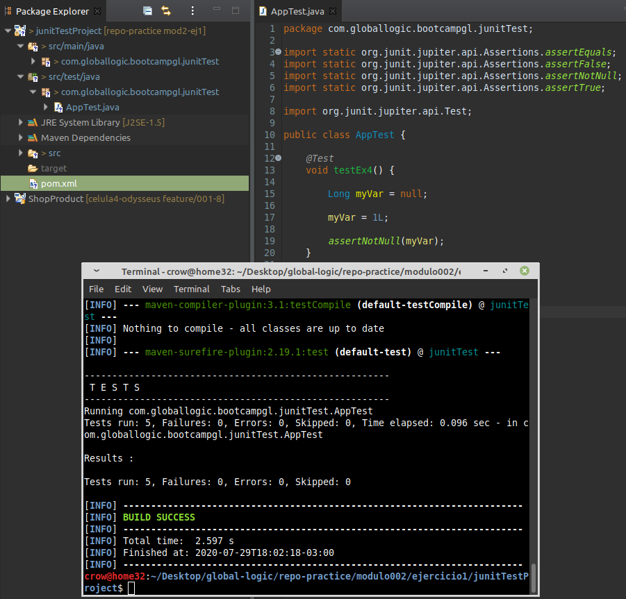
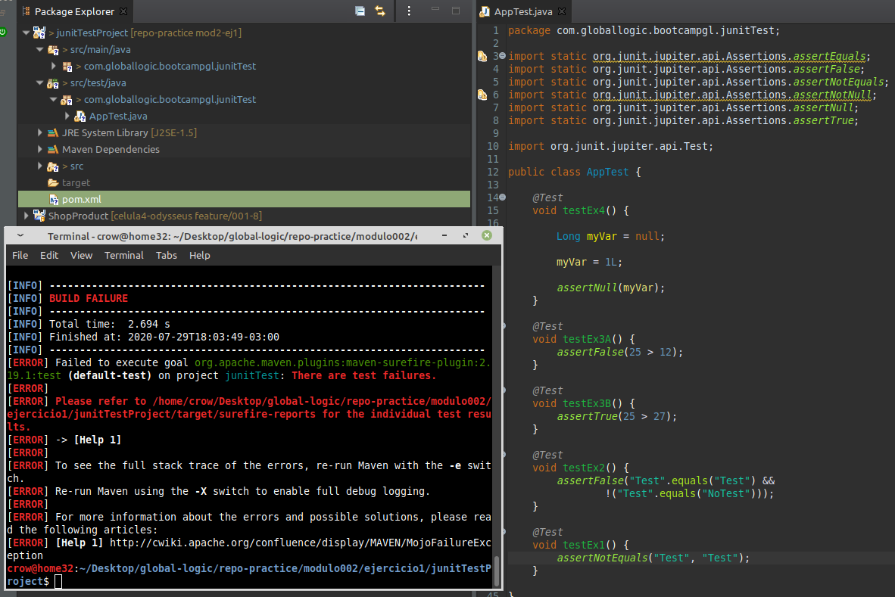
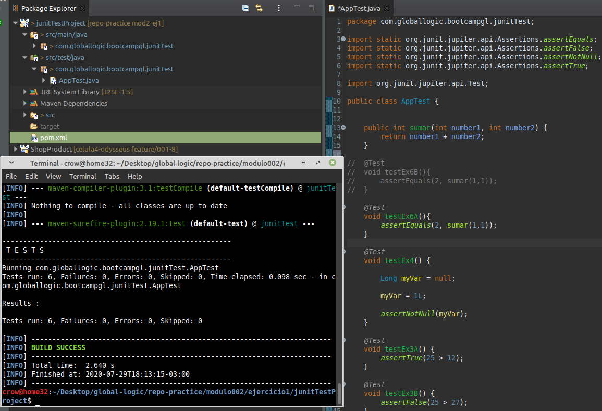
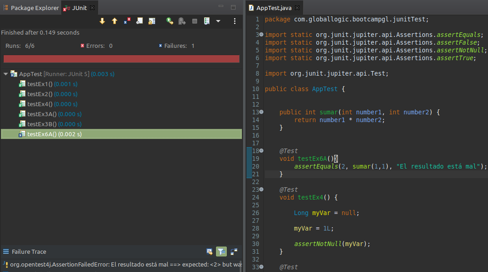
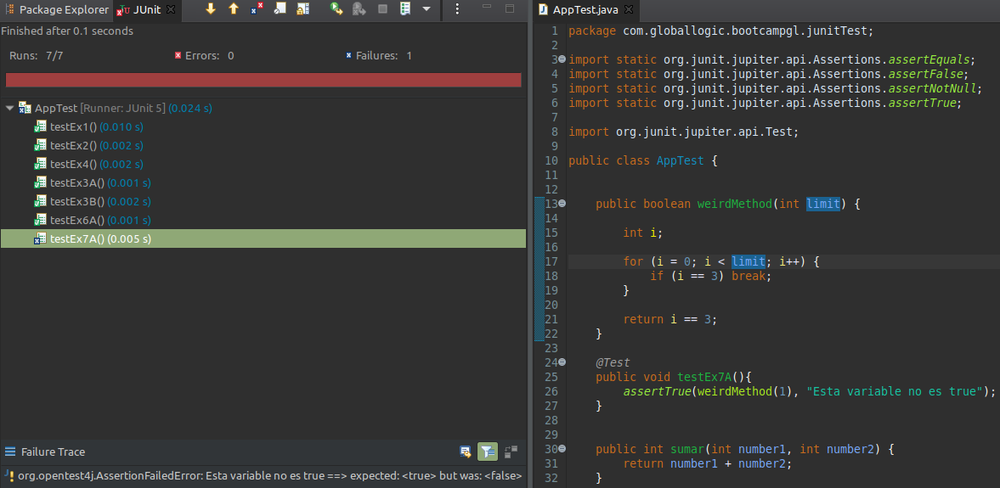
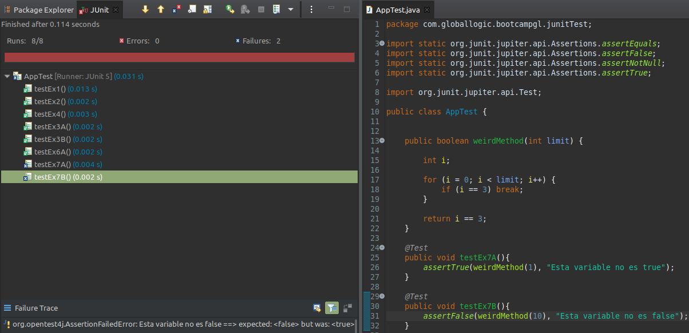

### Introducción a JUnit 5 y assertions

1. Agregar assertions a un proyecto.  
- Importar el proyecto: junitTestProject.7z  
- Crear el testCase de la clase: App.java  
- Crear en el path src/test/java/com/globallogic/bootcampgl/junitTest la clase AppTest conteniendo:  
  ```java  
  package com.globallogic.bootcampgl.junitTest;  
  class AppTest {  
  }  
  ```  
- Agregar una assertion para validar que 2 Strings sean iguales:  
  ```java  
  @Test  
  void test() {  
  assertEquals("Test", "Test");  
  }  
  ```  
  
- Ejecutar la prueba con el comando mvn test obteniendo un resultado similar a:  
  ```  
  -------------------------------------------------------  
  T E S T S  
  -------------------------------------------------------  
  Running com.globallogic.bootcampgl.junitTest.AppTest  
  Tests run: 1, Failures: 0, Errors: 0, Skipped: 0, Time elapsed: 0.072 sec - in com.globallogic.bootcampgl.junitTest.AppTest  
  Picked up _JAVA_OPTIONS: -Dawt.useSystemAAFontSettings=lcd  
  Results :  
  Tests run: 1, Failures: 0, Errors: 0, Skipped: 0  
  ```
  
    
  
---
2. Crear un Test donde se evalúe, dadas tres variables _String_, dos sean iguales y la tercera sea distinta.  
  
    
  
---
3. Crear un Test con las siguientes assertions:  
- 25 > 12 sea verdadero  
- 25 > 27 sea falso  
  
    
  
---
4. Crear un Test donde se evalúe una variable _Long_ inicializada en _null_. Luego asignarle el valor 1 volver a verificar, pero que esta vez no sea _null_.  
  
    
  
---
5. Modificar los ejercicios anteriores (2, 3 y 4) para que todas las verificaciones resulten en error.  
  
    
    
---
6. Crear un método que sume dos parámetros del tipo _int_. Crear un test que utilice este método enviando dos valores y que verifique:  
- Que la suma sea correcta  
  
    
    
- Que la suma sea incorrecta con el mensaje "El resultado está mal: "  
  
    
  
---
7. Crear un método con las siguientes condiciones:  
- Debe retornar un boolean  
- Realizar un For, con valor inicial 0 y donde el valor máximo de iteración será recibido por parámetro.  
- Se debe colocar un corte en la iteración cuando este llegue a 3 retornando _true_, en caso contrario retornar _false_  
  
Crear un Test que utilice este método y donde se realice las assertions en lo siguientes casos:  
- Enviar un valor máximo y que sea true con el mensaje "Esta variable no es true:"  
  
  
    
- Enviar un valor máximo y que sea false con el mensaje "Esta variable no es false:"  
  
    
  
