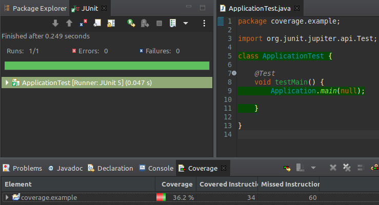
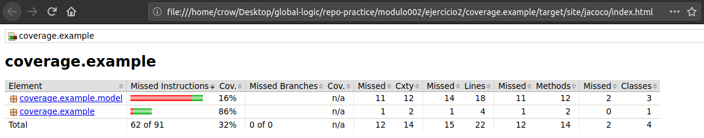
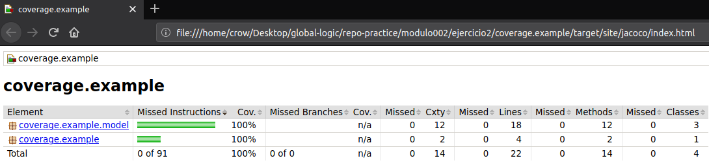
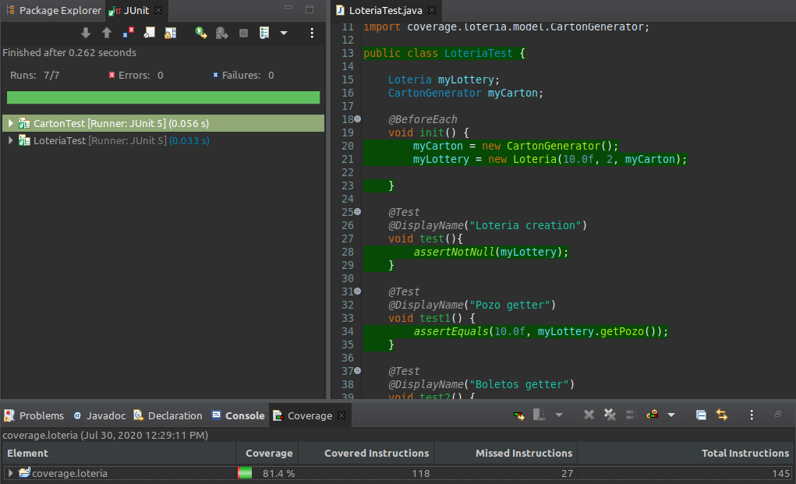

### Code Coverage
  
1. Para este ejemplo, utilizaremos el proyecto provisto en el archivo: coverage.example.zip.  
- Agregar la dependencia Maven del plugin Jacoco para tests de cobertura. En el pom agregar:
  ```xml
  <plugin>
    <groupId>org.jacoco</groupId>
    <artifactId>jacoco-maven-plugin</artifactId>
    <version>0.7.7.201606060606</version>
  
    <executions>

      <execution>
        <goals>
          <goal>prepare-agent</goal>
          </goals>
      </execution>

      <execution>
        <id>report</id>
          <phase>prepare-package</phase>
            <goals>
              <goal>report</goal>
            </goals>
      </execution>

    </executions>
  
  </plugin>
  ```  
- Verificar la cobertura de test actual: ejecutando el target de maven verify y verificar el resultado en *target/site/jacoco/index.html*  
  
    
    
  
- Crear tests para cubrir el 100% de la cobertura, mostrando el resultado tras ejecutar nuevamente el verify.  
  
    
  
---
2. Al ejercicio del archivo coverage.loteria.zip, agregar los test necesarios para cubrir el 80% del código con las pruebas. ¿Cómo podría asegurar una cobertura del 100% del código?  

  

Para obtener el 100% de cobertura habría que testear todas las instrucciones del programa

