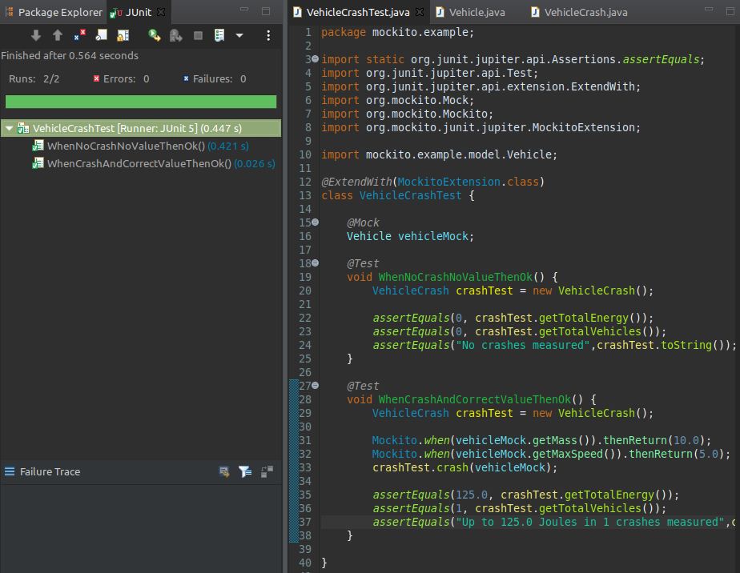

### Mockito  
  
1. Para este ejemplo, utilizaremos el proyecto provisto en el archivo mockito.example.zip. Para poder implementar un test completo de la librería, se tendrá que crear un mock para probar los objetos instanciados, para ello:  

- Agregar al pom las dependencias de mockito:  
  - **groupId**: org.mockito, **artifactId**: mockito-core, **version**: 3.4.0, **scope**: test  
  - **groupId**: org.mockito, **artifactId**: mockito-junit-jupiter, **version**: 3.4.0, **scope**: test  
- Modificar el test para que utilice mockito, agregando la annotation:
  ```java  
	@ExtendWith(MockitoExtension.class)  
  ```  
  
- Implementar un mock de la interfaz y probar la librería:
  - Agregar un atributo a la clase: 
  ```java  
  @Mock  
  Vehicle vehicleMock;  
  ```
 

  - Modificar el test Crash para que utilice el mock y volver a realizar la prueba.  
  ```java  
  @Test  
  void WhenCrashAndCorrectValueThenOk() {  
  ...  
  Mockito.when(vehicleMock.getMass()).thenReturn(10.0);  
  Mockito.when(vehicleMock.getMaxSpeed()).thenReturn(5.0);  
  crashTest.crash(vehicleMock);  
  ...  
  ```
  
    

---
2. En base al ejercicio 2, tomando el proyecto de la lotería, sin modificaciones sobre las clases del paquete **coverage.loteria**, construir un test que genere los mocks necesarios para cubrir un 100% las
pruebas de cobertura.  
  
  
  
---
__Para los siguientes ejercicios utilizaremos el proyecto provisto en el archivo `mockito-example-calculator.zip`.__  
  
3. Implemente tests que validen los 4 métodos básicos de CalculatorServiceImpl, mockeando las implementaciones de BasicOperationsService. Luego, utilice el método _verify()_ de mockito para validar que los métodos mockeados de BasicOperationsService fueron efectivamente invocados.  
    
  
  
---
4. Implemente un test que mockee el comportamiento del método _getListOfNumbers()_ de la interfaz `DataService`, devolviendo una lista de enteros para que se valide el número promedio de esa lista, usando el método CalculatorServiceImpl.calculateAverage(). Por ejemplo, ante una entrada de valores `{1, 2, 3, 4, 5}` se debe validar que su promedio es 3. Luego, modifique el código del test para que el valor de retorno del método getListOfNumbers() esté preconfigurado antes de ejecutar los casos.  
  
    
  
---
5. Ahora, implemente otro test donde esta vez el método `getListOfNumbers()` devuelva null y se espere un NullPointerException.  
  
    
  
---
6. Modifique el método CalculatorServiceImpl.calculateDivision(int a, int b) para que arroje una custom exception ZeroDivisionException de división por cero cuando b sea 0. Defina un test que espere por ese tipo de excepción. Agregue luego una verificación para corroborar que el método `BasicOperationsService.divide(a, b)` nunca es invocado.
  
    
  
---
7. Implemente un test donde, a partir del resultado de una suma con `calculateSum()`, se verifique que el texto a mostrar del método `printResult()` es el esperado. Por ejemplo, si el resultado de una suma es 5, se debe validar que `printResult()` devuelva "El resultado es 5.0".  
  
  
  
---
8. Implemente el método `CalculatorServiceImpl.isOdd()` (esPar). Defina un test parametrizado donde se valide que una lista de valores dada son números pares.  
  
  
  
---
9. Implemente la interfaz BasicOperationsService. Defina un test que espíe la invocación a alguno de sus métodos.  
  
  
  
---
10. Implemente la interfaz DataService. Defina un test que setee el listOfNumbers pero mockee el comportamiento de getListOfNumbers(). Valide que el tamaño del vector de números devuelto coincida con la lista definida del mock, y no con la lista seteada. (Utilice vectores de distinto tamaño para validar esto último).
  
    
    
