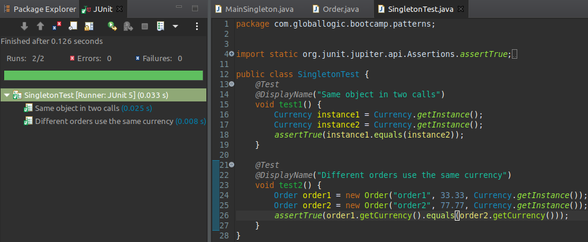

Para toda esta práctica crear un proyecto maven llamado `patterns` con el basepath `com.globallogic.bootcamp.patterns` importando las dependencias necesarias para ejecutar pruebas de Junit5 (ver prácticas anteriores)  
  
---
### Patrón Delegation
1. Crear una clase `ElectricalAppliance`, con el atributo `power` (con valor 500) y un método `TurnOn` que consuma 50 puntos de power.  
- Crear una clase `ElectricalOven` que herede de `ElectricalAppliance` y al ejecutar `TurnOn` consuma 75 puntos de power.  
-  Crear una tercera clase `LedAppliance` con el método `TurnOn` (que no herede de `ElectricalAppliance`) y que consuma 100 power.  
	La clase `ElectricalOven` tiene un atributo `LedAppliance` y un método `TurnLed` que consume 100 power al `ElectricalOven`.  
- Agregar en `Main`: Una instancia de `ElectricalOven` que al comenzar imprima su energía inicial (power), ejecutar `TurnOn`, imprimir `power`, ejecutar `TurnLed` e imprimir su energía. (Debería terminar con 325 de power).  
- Agregar los tests necesarios para demostrar que se realizó correctamente el ejercicio.   
  
    
  
---
### Patrón Singleton  
2. Crear una clase `Currency`, con el atributo `name`, siendo esta un singleton. Para ello:  
- Crear la clase como normalmente se crea.  
- Hacer su constructor por default sea privado e inicialice `name` con el valor "ARS"  
- Crear un atributo de clase `instance` del tipo `Currency` y asignarle una nueva instancia.  
- Crear un método de clase `getInstance` que retorne el valor de la instancia.  
- Armar un test de JUnit que compruebe al utilizar 2 veces el método `getInstance` de la clase retorne el mismo objeto.  
  
    
   
---
3. Crear una clase `Order`, con los atributos `description`, `count` y `currency` (del ejercicio 2), agregando un constructor con todos los elementos. Armar tests de JUnit donde compruebe:  
- 2 instancias diferentes de `Order` utilizan el mismo `Currency` a pesar de tener los mismos parámetros.
  
     
    
---
4. Crear una clase `Product`, con el atributo `name` (con valor "Clavos") siendo esta un singleton, e incluir en la clase `Order` un atributo de esta clase. Agregar los tests necesarios para demostrar que se realizó correctamente el ejercicio.
  
  
---
### Inyección de dependencia
5. Crear una clase `Game` con el atributo `title`
- Crear una clase `Playstation` con el atributo `videogame` de la clase `Game`, un constructor que inyecte un objeto `Game` en el atributo `videogame`, un setter que reemplace el objeto `Game`, un método `AskMyGame` que devuelva el string “El videojuego que estoy corriendo es: “ y el título del videojuego inyectado. En caso de que no tenga ningún videojuego, que devuelve el string “¡Estoy vacío!”.
- En el método `Main`, crear una instancia de `Playstation` inyectando un juego de titulo “Resident Evil”, imprimir el contenido de `AskMyGame()`.
- Inyectar otra instancia de `Game` (usando el setter) con el título “Brawlhalla” e imprimir la respuesta de `AskMyGame()`.
- Por último, inyectar en `null` un `videogame` e imprimir el contenido de `AskMyGame()`.

   
