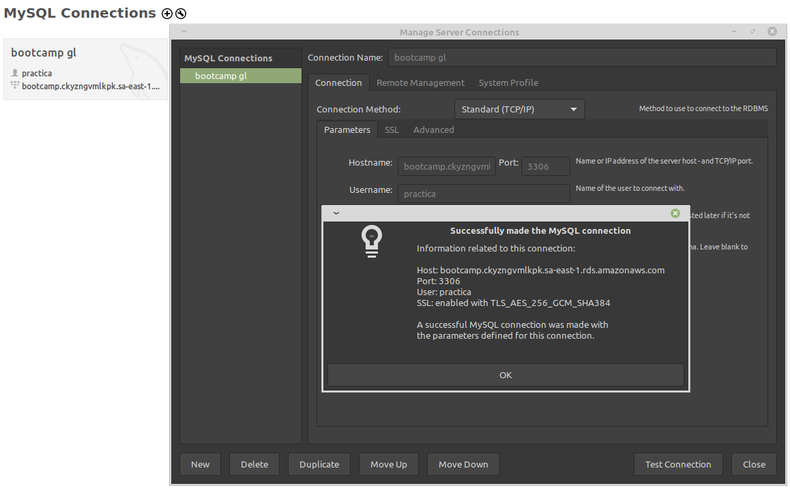
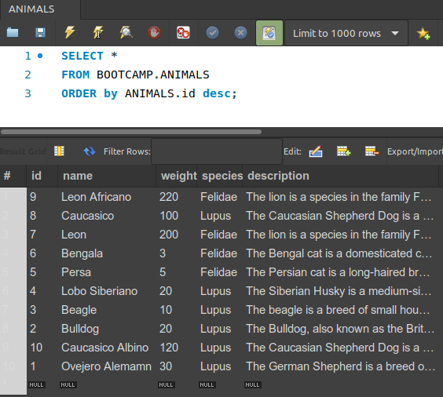
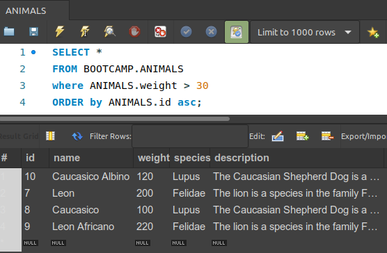
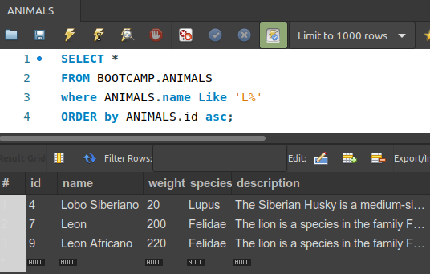
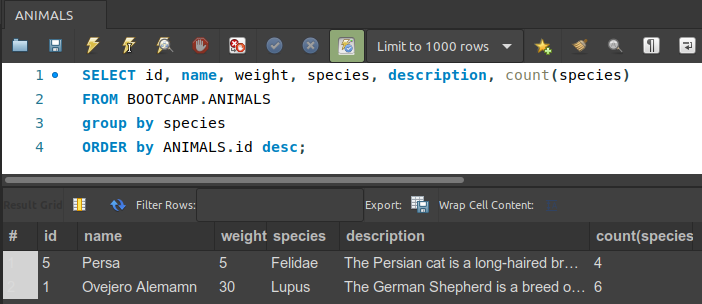
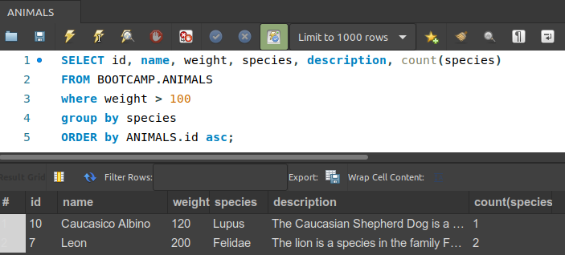

### Modelo relacional y SQL
  
1. Setup ambiente mysql con usuario para el ejercicios de lectura de base.  
  
    
  
2. Generar la consulta para obtener animales ordenados por su id de forma descendente.  
  
    
  
3. Generar la consulta para obtener animales ordenados por su id de forma ascendente y que pesen más de 30 Kg.  
  
    
  
4. Generar la consulta para obtener animales ordenados por su id de forma ascendente y cuyo nombre comience con L.  
  
    
  
5. Generar la consulta para obtener animales ordenados por su id de forma descendente y agrupados por su especie.  
  
    
  
6. Generar la consulta para obtener los animales cuyo máximo peso sea mayor a 100 ordenados por su id de forma ascendente y agrupados por su especie.  
  
    
  
