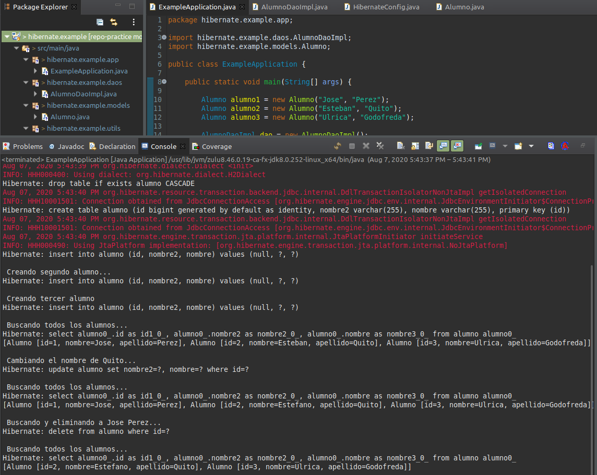

### Hibernate  
  
1. A partir del proyecto en el archivo: `hibernate.example.zip`, agregar la entidad `Alumno` y su conexión a la base de datos `H2` con sus operaciones `CRUD`. Para ello, agregar las siguientes dependencias:  
	- **groupId**: `org.hibernate`, **artifactId**: `hibernate-core`, **version**: `5.4.18.Final`  
	- **groupId**: `com.h2database`, **artifactId**: `h2`, **version**: `1.4.200`  
  
Agregar la entidad (clase)Alumno, con sus getters, setter, toString y sus constructores por default y con todos atributos en base a la siguiente estructura:  
	`Alumno`:  
	- `Id`  
	- `Nombre`  
	- `Apellido`  

Agregar en la entidad `Alumno` las siguientes anotaciones:  
	- `Entity`: a nivel de clase  
	- `Table`: con el parámetro `name` con el valor `alumno` a nivel de clase  
	- `Id`: para el atributo `id`  
	- `Column`: con el parámetro `name` con el valor `nombre2` para el atributo `apellido`  
	- `Column`: con el parámetro `name` con el valor `nombre` para el atributo `nombre`  
	- `Column`: con el parámetro `name` con el valor `id` para el atributo `id`  
  
Agregar una Clase `AlumnoDao` con los siguientes métodos:  

```java
	public void createAlumno(Alumno alumno) {  
		Transaction transaction = null;  
		try (Session session = HibernateConfig.getSessionFactory().openSession()) {  
			transaction = session.beginTransaction();  
			session.save(alumno);  
			transaction.commit();  
		} catch (Exception e) {  
			if (transaction != null) {  
				transaction.rollback();  
			}  
			e.printStackTrace();  
		}  
	}  
  
	public List <Alumno> getAlumnos() {  
		try (Session session = HibernateConfig.getSessionFactory().openSession()) {  
			return session.createQuery("from Alumno", Alumno.class).list();  
		}  
	}  
  
	public List<Alumno> getAlumnos(String nombre, String apellido) {  
		try (Session session = HibernateConfig.getSessionFactory().openSession()) {  
			return session.createQuery("from Alumno s where s.nombre=:nombre and s.apellido=:apellido"  
		, Alumno.class).setParameter("nombre", nombre).setParameter("apellido", apellido).list();  
		}  
	}  
```
  
Agregar a la Clase `AlumnoDao` con los siguientes métodos  
```java  
	public void updateAlumno(Alumno alumno) {  
		Transaction transaction = null;  
		try (Session session = HibernateConfig.getSessionFactory().openSession()) {  
		transaction = session.beginTransaction();  
		session.update(alumno);  
		transaction.commit();  
		} catch (Exception e) {  
		if (transaction != null)  
			transaction.rollback();  
			e.printStackTrace();  
		}  
	}  
  
	public void removeAlumno(Alumno alumno) {  
		Transaction transaction = null;  
		try (Session session = HibernateConfig.getSessionFactory().openSession()) {  
		transaction = session.beginTransaction();  
		session.delete(alumno);  
		transaction.commit();  
		} catch (Exception e) {  
			if (transaction != null)  
			transaction.rollback();   
			e.printStackTrace();    
		}  
	}  
```  
  
Agregar una Clase `HibernateConfig` con el siguiente método:  
```java
	private static SessionFactory sessionFactory = null;  
	public static SessionFactory getSessionFactory() {  
		if (sessionFactory == null) {  
			try {  
				Configuration configuration = new Configuration();  
				Properties settings = new Properties();  
				settings.put(Environment.DRIVER, "org.h2.Driver");  
				settings.put(Environment.URL, "jdbc:h2:C:\\GLBootCamp\\data\\Alumno.h2");  
				settings.put(Environment.USER, "root");  
				settings.put(Environment.PASS, "root");  
				settings.put(Environment.HBM2DDL_AUTO, "create-drop");  
	  
				configuration.setProperties(settings);  
				configuration.addAnnotatedClass(Alumno.class);  
				ServiceRegistry serviceRegistry = new StandardServiceRegistryBuilder()  
					.applySettings(configuration.getProperties()).build();  
				sessionFactory = configuration.buildSessionFactory(serviceRegistry);  
			} catch (Exception e) {  
				e.printStackTrace();  
			}  
		}  
		return sessionFactory;  
	}  
```
  
Agregar una clase `ExampleApplication` donde muestre la utilización del DAO, realizando las siguientes operaciones:  
	- Agregar los alumnos  
		- `Jose Perez`  
		- `Esteban Quito`  
	- Ulrica Godofreda  
  
Modificar el alumno `Esteban Quito` por su nombre real: `Estefano`  
  
Buscar y eliminar el alumno `Jose Perez` porque ya se encontraba en una práctica anterior.  
    
  
  
---
2. Crear un CRUD utilizando `H2` para la entidad Menu, donde se muestra con el siguiente ejemplo. Crear las pruebas de JUnit necesarias para mostrar su funcionamiento completo:  
menu:  
- `plato`:
	- `nombre`: Milanesa Clasica  
	- `descripcion`: una delicada milanesa con crocantes papas fritas finamente seleccionadas  
	- `precio`: 500.00  
  
- `plato`:  
	- `nombre`: Lomo al piedra  
	- `descripcion`: un curioso plato donde se utilizan piedras calentadas al rojo vivo para cocinar el lomo junto a especias orientales y sudamericanas logrando un elixir entre la textura y el sabor.  
	- `precio`: 750.00  
  
  
  
---
3. Crear un CRUD utilizando H2 para la entidad `Carrera`, donde se muestra con el siguiente ejemplo. Crear las pruebas de JUnit necesarias para mostrar su funcionamiento completo:  
```json
	{
		"carrera": {
			"fecha": "2020-07-17",
			"nombre": "Gran Carrera Global",
			"competidores": [
				{"numero":2,"Nombre":"Sebastian Loeb"},
				{"numero":3,"Nombre":"Marcus Gronholm"},
				{"numero":7,"Nombre":"Carlos Sainz"},
				{"numero":11,"Nombre":"Petter Solberg"}
				]
		}
	}
```
