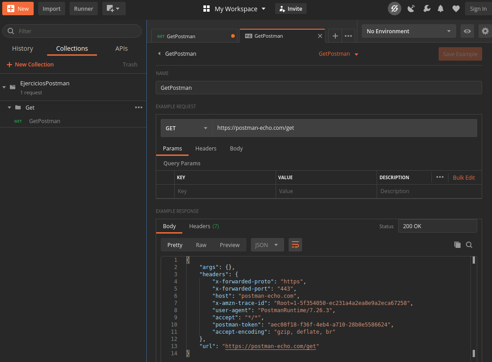
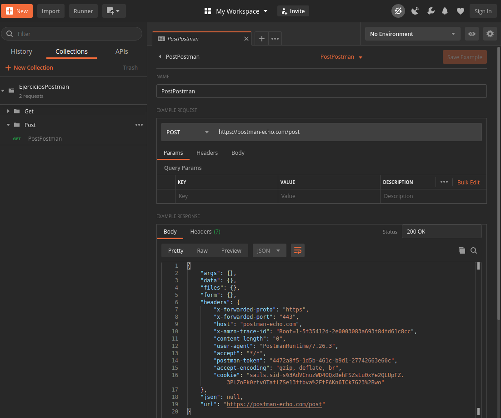
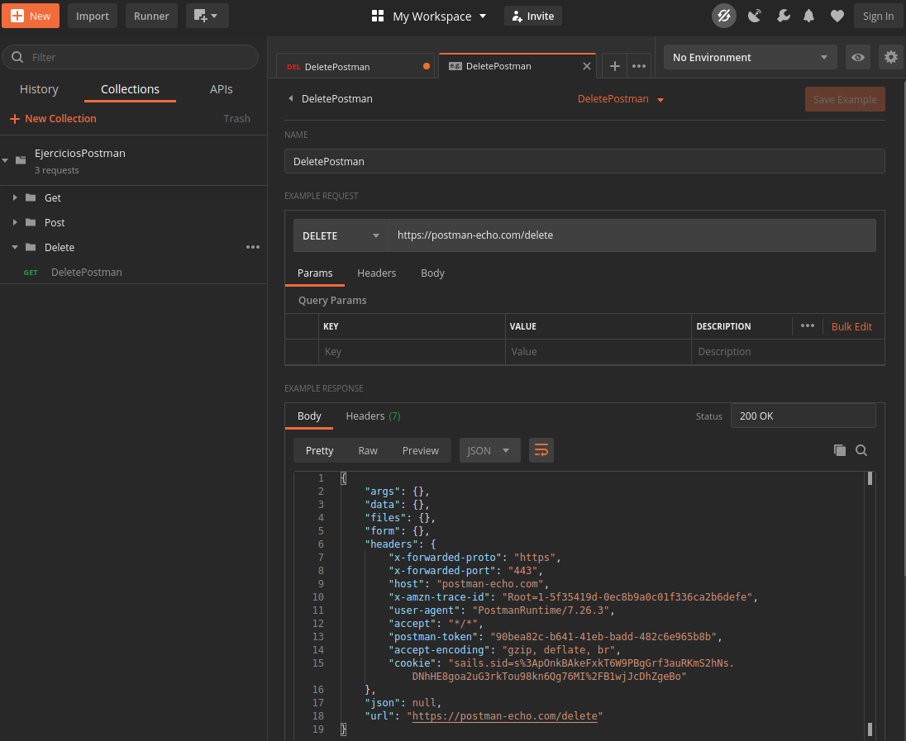
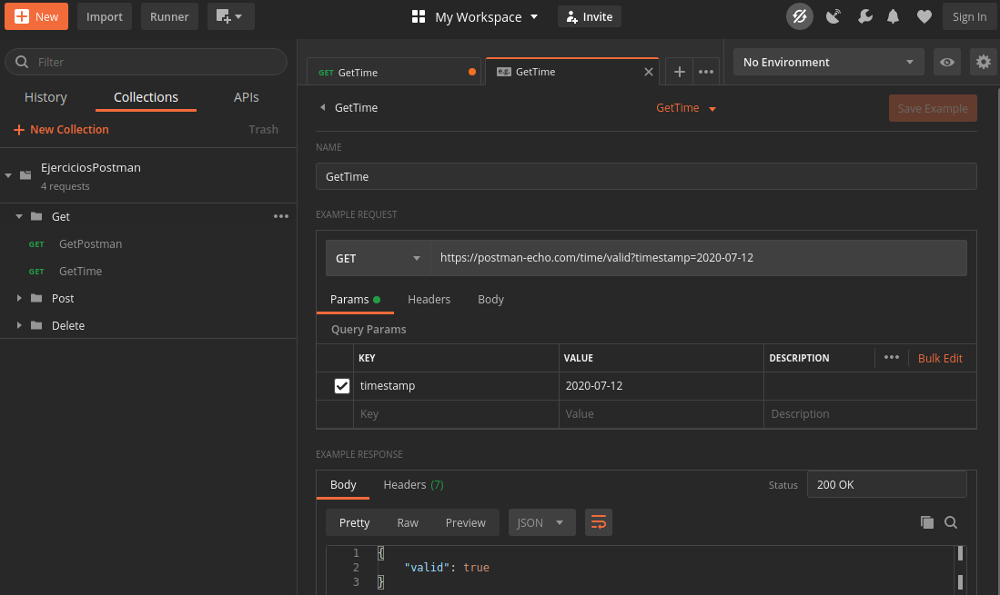
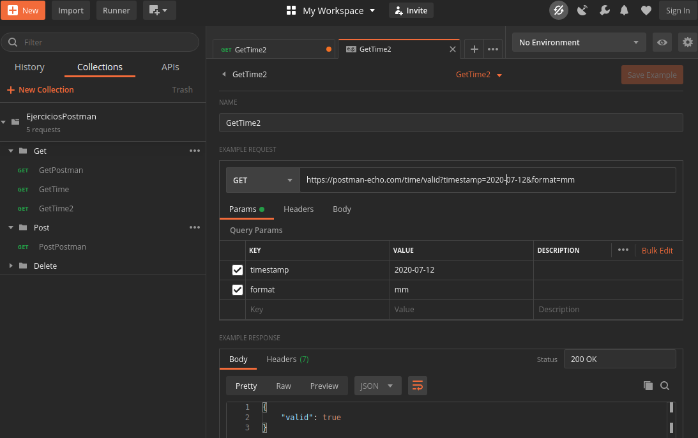
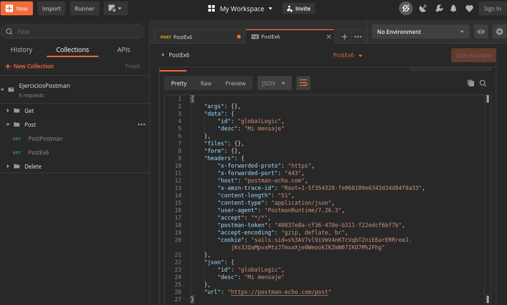
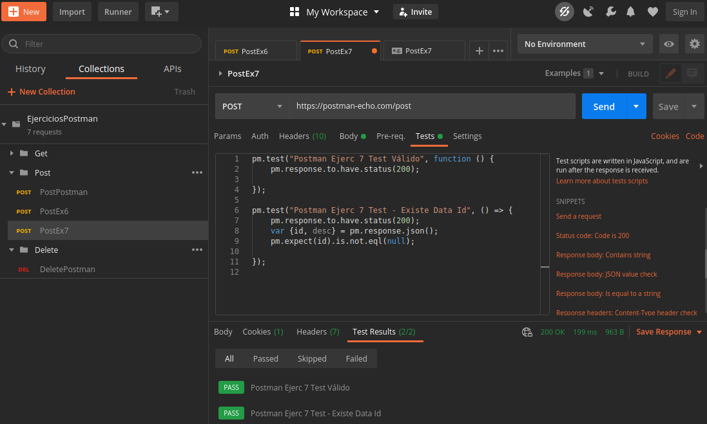
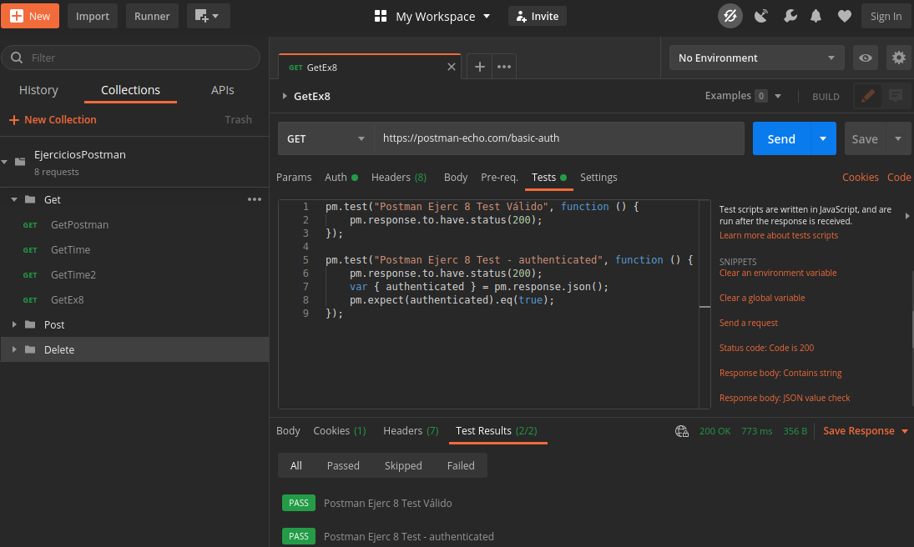

### Introducción a Postman y prueba de servicios  
  
1. Realizar una petición `GET` hacia `https://postman-echo.com/get`  
	- Crear la Collection `"EjerciciosPostman"`  
	- Agregar el Folder `"Get"`  
	- Agregar un nuevo Request con el nombre `"GetPostman"`.  
	- Seleccionamos el verbo http `GET`  
	- Pegamos la url `https://postman-echo.com/get`  
	- Verificar Respuesta y guardar response (as example)  
  
    
  
---
2. Crear la petición (Crear folder Post) POST hacia `https://postman-echo.com/post`. Ejecutar, verificar la respuesta y guardar response (as example)  
  
    
  
---
3. Crear y ejecutar la petición (Crear folder Delete) DELETE hacia `https://postman-echo.com/delete`. Verificar la respuesta y guardar response (as example)  
  
    
  
---
4. Crear y ejecutar la petición (En Folder Get) Get hacia `https://postman-echo.com/time/valid`, con el siguiente query Params `timestamp = 2020-07-12`. Verificar la respuesta y guardar response (as example)  
  
    
  
---
5. Crear y ejecutar la petición (En Folder Get) Get hacia `https://postman-echo.com/time/valid`, con los siguientes query Params `timestamp = 2020-07-12` y `format=mm`. Verificar la respuesta y guardar response (as example)  
  
    
  
---
6. Crear y ejecutar la petición (En Folder Post) Post hacia `https://postman-echo.com/post`, con los siguientes header y body. Verificar la respuesta y guardar response (as example)  
	- Header:  
			`Content-Type= application/json`  
	- Body:  
```json
		{
			"id":"globalLogic",
			"desc":"Mi mensaje"
		}
```
  
    
  
---
7. Agregar un nuevo Request (Copia del 6), configurar los siguientes test:  
- Verificar `http code response = 200`. Retornando el mensaje: `"Postman Ejerc 7 Test Válido"`  
- Si `http-code = 200`, verificar que `data.id` (Presente en la estructura JSON Response) no sea vacía. Retornando el mensaje: `"Postman Ejerc 7 Test - Existe Data Id"`  
  
    
  
---
8. Crear y ejecutar la petición (En Folder Get) Get hacia `https://postman-echo.com/basic-auth` configurando Basic Auth:
- Username: postman
- Password: password
  
Configurar los siguientes test:  
- Verificar `http code response = 200`. Retornando el mensaje: `"Postman Ejerc 8 Test Válido"  
- Si `http-code = 200`, verificar que authenticated (Presente en la estructura JSON Response) no sea `true`. Retornando el mensaje: `"Postman Ejerc 8 Test - authenticated"` Verificar la respuesta y guardar response (as example)

  

