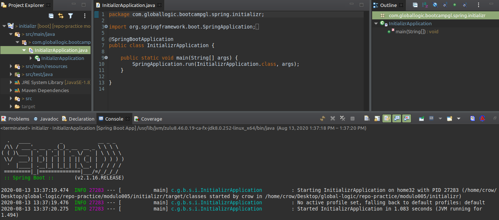

### Introducción a Spring  
  
1- Crear un proyecto en Spring Boot manualmente:  
Pasos:  
	- Crear un proyecto Maven con la siguiente configuración:  
		- **Paquete**: `com.globallogic.bootcampgl.spring`  
		- **Nombre de proyecto**: `manual` **Version**: `1.0.0`  
		- **Padre**:  
			- **groupId**: `org.springframework.boot`  
			- **artifactId**: `spring-boot-starter-parent`  
			- **version**: `2.1.5.RELEASE`  
		- **Dependencia**:  
			- **groupId**: `org.springframework.boot`  
			- **artifactId**: `spring-boot-starter`  
  
Crear clase `ManualApplication` en el paquete `com.globallogic.bootcampgl.spring.manual` conteniendo:  
```java
	@SpringBootApplication
	public class ManualApplication {
		public static void main(String[] args) {
			SpringApplication.run(ManualApplication.class, args);
		}
	}
```
  
- Ejecutar la aplicación.  
  
      
  
- Crear un proyecto en Spring Boot con el [initializer](https://start.spring.io/)  
Pasos:  
- Ir a la página: `Spring Initializr`  
- Cargar los campos:  
	- **Group**: `com.globallogic.bootcampgl.spring` **Artifact**: `initializr`  
	- **Project**: `Maven` **Language**: `Java` **Version**: `8`  
	- **Spring Boot**: `2.1.15`  
- Seleccionar la opción `Generate` y descargar el proyecto  
- Importar el proyecto en el STS: ir a `File` >>> `Import` >>> `Projects from Folder or Archive` >>> `Archive`, seleccionar el archivo descargado y elegir solo la opción de un proyecto maven y clickear `Finish`.  
- Compilar y ejecutar  
  
    
  
---
2. Crear un proyecto en Spring Boot para `Customer` con el grupo `com.globallogic.bootcampgl` utilizando el STS, que implemente la interface `CommandLineRunner` y cuando inicie la aplicación muestre por consola al cliente definido por la clase `Customer`:  
- `name`: Jose Perez
- `dni`: 234567890
- `id`: 12342
  
---
3. Crear un proyecto en Spring Boot para `Order` con el grupo `com.globallogic.bootcampgl` utilizando el STS, donde se muestra la utilización del `@Autowired` implementando una clase `OrderFactory` que a través del método `getNewOrder()` genera una nueva instancia de la clase `Order` para mostrarla en pantalla. Esta clase está compuesta por:  
- `product`: C-00221
- `count`: 1000
- `customer`: 12342
  
---
4. Crear un proyecto en Spring Boot para `Product` con el grupo `com.globallogic.bootcampgl` utilizando el STS, donde implemente un bean de `ProductRepository`, para implementar el método `getById(id)` para obtener el producto definido por su `id` y compuesta por:  
- `id`: C-00221
- `name`: Clavos
  
---
5. Rehacer los ejercicios 2.2, 2.3, 2.4 con el `Initializr`, utilizando el grupo `com.globallogic.bootcampms`
