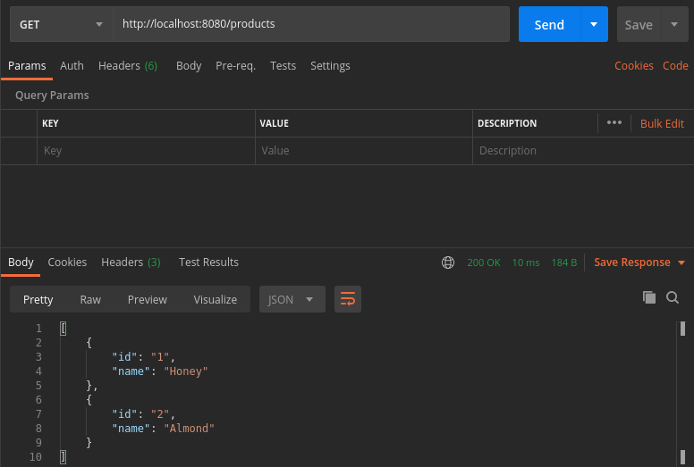
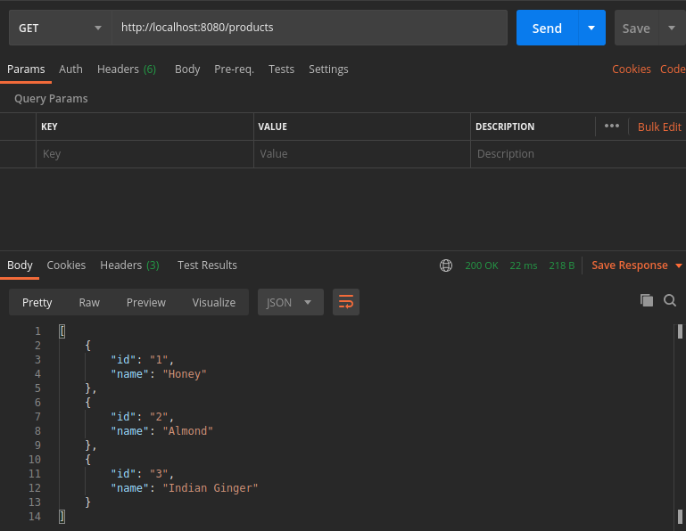
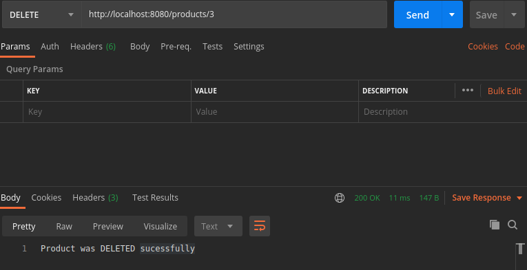

### Introducción a Rest con Spring Boot  
  
Para este ejercicio tomamos como base el proyecto serviceProducts del `Ejercicio 3.x/Base/serviceProducts.zip`. Vamos a realizar un servicio simple que contendrá 4 operaciones, GET, POST, PUT y DELETE:  
  
1. Para comenzar vamos a ir al IDE y veremos en el proyecto de `serviceProducts`, dentro de `src/main/java/com.globallogic.bootcampgl` que tenemos 3 carpetas `controller`, `dto` y `service`. En `service` tenemos una clase de tipo interfaz `ProductService`, en esta clase vamos a definir
el método `getProducts()` el cual nos va a devolver una colección de `ProductDTO`:  
  
```java
  public abstract Collection<ProductDTO> getProducts();
```
  
Como podrán ver dentro de service tenemos una carpeta de nombre `impl`, con una clase de nombre `ProductServiceImpl` en la cual implementamos los métodos de `ProductService`. En esta agregamos el
siguiente método:  
  
```java
  public abstract Collection<ProductDTO> getProducts();
  
  @Override
  public Collection<ProductDTO> getProducts() {return productRepo.values();}
```
_*Para tener en cuenta en la clase `ProductServiceImpl` vamos a tener un `HashMap` mediante el cual podremos trabajar los valores que vayamos creando, modificando, borrando y obteniendo._  
    
- En la carpeta `dto` vemos que tenemos creada la clase `ProductDTO`, la cual posee 2 atributos `id` y `name`  
- En la carpeta `controller` tenemos la clase `ProductServiceController`, en dicha clase vamos a agregar la invocación a `ProductService` y el método `getProduct`:  
  
```java
  @RequestMapping(value = "/products")
  public ResponseEntity<Object> getProduct() {
    return new ResponseEntity<>(productService.getProducts(), HttpStatus.OK);
  }
```
  
- Compilar y ejecutar  
- Ir a postman, agregamos un nuevo tab, seleccionamos GET y ponemos la siguiente URL `http://localhost:8080/products`. La salida esperada es:  
```json
  [{"id": "1","name": "Honey"},{"id": "2","name": "Almond" }]
```
  
    
  
---
2. Vamos a continuar trabajando en el proyecto del ejercicio 3. En este ejercicio vamos a agregar el método **POST**.  
- Vamos a la clase `ProductService`, y agregamos un método `createProduct` que no retorne valor, en el cual tengamos como parámetro un producto de tipo `ProductDTO`.
- En la clase `ProductServiceImpl`, implementamos el método creado en `ProductService` en el cual realizamos un **put** a `productRepo` con `product.getId()` y `product`.
- En la clase `ProductServiceController`, vamos a crear un método de nombre `createProduct` que retorne `ResponseEntity<Object>` y que tenga como parámetros un `@RequestBody ProductDTO`
- En este método, al igual que en el **get**, vamos a agregar la annotation `@RequestMapping` que tenga value con `“/products”` y `method` con `RequestMethod.POST`. Invocar al método `createProduct` de `ProductService` y retornamos  
```java
  new ResponseEntity<>("Product is created successfully", HttpStatus.CREATED);
```
- Compilar y ejecutar
- Ir a postman, agregamos un nuevo tab, seleccionamos **POST** y ponemos la siguiente URL `http://localhost:8080/products` y como request `{ "id":"3", "name":"Ginger"}`
- Vuelva a ejecutar el **GET** del ejercicio anterior.  
  
    
  
---
3. Vamos a continuar trabajando en el proyecto del ejercicio 3. En este ejercicio vamos a agregar el método **PUT**.  
- Vamos a la clase `ProductService`, vamos a agregar un método abstracto `updateProduct` que no retorne valor, en el cual tengamos como parámetros un String `id` y `product` de tipo `ProductDTO`.  
- En la clase `ProductServiceImpl`, implementamos el método creado en `ProductService` en el cual hacemos una eliminación (delete) del `id` en `productRepo`, a `product` le agregamos el `id` y realizamos una actualización (**put**) a `productRepo` con `product.getId()` y `product`.  
- En la clase `ProductServiceController`, vamos a crear un método de nombre `updateProduct` que retorne `ResponseEntity<Object>` y que tenga como parámetros un `@PathVariable("id") String id` y `@RequestBody ProductDTO`.
- En este método, al igual que en el `create`, vamos a agregar la annotation `@RequestMapping` que tenga `value` con `"/products/{id}"` y `method` con `RequestMethod.PUT`.
- Invocar al método `updateProduct` de `ProductService` y retornamos:
```java
  new ResponseEntity<>("Product is updated successfully", HttpStatus.OK);
```
- Compilar y ejecutar
- Ir a postman, agregamos un nuevo tab, seleccionamos **PUT** y ponemos la siguiente URL `http://localhost:8080/products/3` y como request `{"name" : "Indian Ginger"}`
- Vuelva a ejecutar el **GET** del ejercicio 1.  
  
    
  
---
4. Vamos a continuar trabajando en el proyecto del ejercicio 3. En este ejercicio vamos a agregar el método **DELETE**.  
- Vamos a la clase `ProductService`, vamos a agregar un método abstracto `deleteProducto` que no retorne valor, en el cual tengamos como parámetros un `id`.
- En la clase `ProductServiceImpl`, implementamos el método creado en `ProductService` en el cual hacemos un remove del id en `productRepo`.
- En la clase `ProductServiceController`, vamos a crear un método de nombre deleteProduct que retorne `ResponseEntity<Object>` y que tenga como parámetros un `@PathVariable(“id”) String id`.
- En este método, al igual que en el create, vamos a agregar el anotation `@RequestMapping` que tenga `value` con `"/products/{id}"` y `method` con `RequestMethod.DELETE`. Invocar al método `deleteProduct` de `ProductService` y retornamos  
```java
  new ResponseEntity<>("Product is deleted successfully", HttpStatus.OK);
```
- Compilar y ejecutar  
- Ir a postman, agregamos un nuevo tab, seleccionamos **DELETE** y ponemos la siguiente URL `http://localhost:8080/products/3`
- Vuelva a ejecutar el **GET** del ejercicio 1.  
  
    
